<p align="center">
  <h1 align="center">🩺 Script Doctor</h1>
  <p align="center">
    <strong>Multi-Agent AI Screenplay Pipeline — Autonomous Writer-Critic Loop with RAG Grounding & Structured Evaluation</strong>
  </p>
  <p align="center">
    
    
    
    
    
  </p>
</p>

---

An **agentic AI pipeline** that writes, critiques, and iteratively refines cinematic screenplay scenes. Three specialized LLM agents — **Outliner**, **Writer**, and **Critic** — collaborate in an autonomous loop powered by [LangGraph](https://www.langchain.com/langgraph), [Google Gemini 2.5 Flash](https://deepmind.google/technologies/gemini/flash/), and a RAG-grounded knowledge base of craft reference examples.

The pipeline runs until the Critic's structured rubric scores the draft **≥ 8/10** across five dimensions, or a maximum of **5 iterations** is reached — whichever comes first.

## ✨ Key Features

| Feature | Description |
|---------|-------------|
| **Multi-Agent Orchestration** | LangGraph state machine coordinates Outliner → Writer ↔ Critic with conditional looping |
| **Structured Pydantic Rubric** | Critic evaluates across 5 dimensions (Dialogue, Pacing, Character Consistency, Thematic Resonance, Dramatic Tension) with enforced 0–10 scoring |
| **RAG Grounding** | ChromaDB vector store with HuggingFace `all-MiniLM-L6-v2` embeddings provides craft reference examples to guide the Writer's style |
| **Creative Defense Mechanism** | Writer justifies departures from Critic feedback, preventing blind regression across iterations |
| **Historical Memory Buffer** | Writer receives trimmed critique history (last 2 iterations) to prevent context window bloat |
| **Score Clamping Validator** | Enforces that overall scores match the computed average of all 5 dimension scores |
| **Stagnation Convergence Detection** | Terminates revisions early if the overall score fails to improve for 2 consecutive runs |
| **Cached DB Singleton** | Reuses vector DB client connection to remove file reload overhead and reduce latency |
| **Anti-Fragile Retries** | Exponential backoff retry logic with random jitter on all LLM calls to prevent API rate limit collisions |
| **Real-Time Web UI** | Flask + Server-Sent Events (SSE) stream pipeline progress live to the browser |
| **Interactive Report Dashboard** | Chart.js radar charts, score progression graphs, and per-iteration critique breakdowns |

## 🏗️ Architecture

```mermaid
graph LR
    A["📝 User Prompt"] --> B["📡 RAG Context<br/><small>ChromaDB + HuggingFace</small>"]
    B --> C["🗺️ Outliner Agent<br/><small>Beat sheet / structure</small>"]
    C --> D["✍️ Writer Agent<br/><small>Screenplay draft</small>"]
    D --> E["🔍 Critic Agent<br/><small>Pydantic rubric scoring</small>"]
    E -->|"Score < 8<br/>+ critique"| D
    E -->|"Score ≥ 8<br/>or 5 iterations"| F["🎬 Final Script<br/>+ HTML Report"]

    style A fill:#7c3aed22,stroke:#7c3aed,color:#e2e8f0
    style B fill:#06b6d422,stroke:#06b6d4,color:#e2e8f0
    style C fill:#eab30822,stroke:#eab308,color:#e2e8f0
    style D fill:#22c55e22,stroke:#22c55e,color:#e2e8f0
    style E fill:#ef444422,stroke:#ef4444,color:#e2e8f0
    style F fill:#7c3aed22,stroke:#7c3aed,color:#e2e8f0
```



### Agent Roles

| Agent | Model Config | Purpose |
|-------|-------------|---------|
| **Outliner** | `gemini-2.5-pro` · temp 0.6 | Produces a detailed beat sheet breaking the scene into beginning/escalation/climax with emotional shifts and power dynamics |
| **Writer** | `gemini-2.5-flash` · temp 0.85 | Generates a fully formatted screenplay scene using the outline, RAG context, and critique history. Includes defense notes justifying creative choices |
| **Critic** | `gemini-2.5-pro` · temp 0.15 | Evaluates the draft against a 5-dimension Pydantic rubric. Returns structured scores, detailed critique, and 3–5 actionable revision instructions |

### Evaluation Rubric (Pydantic `ScriptEvaluation`)

```
┌──────────────────────────┬────────────────────────────────────────────────┐
│ Dimension                │ What It Measures                               │
├──────────────────────────┼────────────────────────────────────────────────┤
│ Dialogue (0–10)          │ Naturalness, subtext, character voice          │
│ Pacing (0–10)            │ Scene beats, lean action lines, no padding     │
│ Character Consistency    │ Faithfulness to prompt archetypes               │
│ Thematic Resonance       │ Emotional register, dramatic stakes             │
│ Dramatic Tension (0–10)  │ Clear stakes, escalation, meaningful hook      │
│ Overall (0–10)           │ Holistic average — 8+ reserved for exceptional │
└──────────────────────────┴────────────────────────────────────────────────┘
```

## 🚀 Quick Start

### Prerequisites

- **Python 3.11+**
- A **Google Gemini API key** — [get one free at AI Studio](https://aistudio.google.com/apikey)

### Installation

```bash
# 1. Clone the repository
git clone https://github.com/YOUR_USERNAME/script-doctor.git
cd script-doctor

# 2. Create and activate a virtual environment
python -m venv venv
# Windows:
venv\Scripts\activate
# macOS/Linux:
source venv/bin/activate

# 3. Install dependencies
# (Production dependencies only)
pip install -r requirements.txt
# (Optional: install dev/testing tools)
pip install -r requirements-dev.txt

# 4. Configure your API key
cp .env.example .env
# Edit .env and paste your GOOGLE_API_KEY
```

### Run via CLI

```bash
python main.py
```

This runs the full pipeline with the built-in default prompt and saves output files (`.txt` transcript + `.html` report) to the gitignored `runs/` directory.

### Run via Web UI

```bash
python api/server.py
```

Open [http://localhost:5000](http://localhost:5000) in your browser. Enter any scene premise and watch the agents work in real-time via SSE streaming.

Concurrency is bounded so simultaneous requests can't exhaust the Gemini quota: at most `MAX_CONCURRENT_JOBS` pipelines run at once (default 2) and up to `MAX_ACTIVE_JOBS` may be queued (default 8) before new requests receive `429`. Both are overridable via environment variables.

## 📂 Project Structure

```
script-doctor/
├── main.py                  # CLI entry point + LangGraph state machine
├── agents/
│   ├── outliner.py          # Beat sheet / structural outline agent
│   ├── writer.py            # Screenplay drafting + revision agent
│   └── critic.py            # Structured rubric evaluation agent (Pydantic)
├── utils/
│   ├── llm.py               # Shared LLM factory with caching
│   └── retry.py             # Exponential backoff retry utility
├── rag/
│   └── retriever.py         # ChromaDB vector store + HuggingFace embeddings
├── data/
│   └── dialogues.txt        # Craft reference corpus (subtext, pacing, tension)
├── runs/                    # Generated .txt transcripts + .html reports (gitignored)
├── report/
│   └── generator.py         # Interactive HTML report with Chart.js dashboards
├── api/
│   ├── server.py            # Flask web server with SSE streaming
│   └── static/
│       └── index.html       # Frontend web UI
├── tests/
│   ├── test_state_transitions.py   # State machine + graph structure tests
│   ├── test_critic_schema.py       # Pydantic evaluation rubric tests
│   ├── test_report_generator.py    # HTML report output tests
│   └── test_utils.py               # LLM factory + retry logic tests
├── requirements.txt         # Production dependencies
├── requirements-dev.txt     # Development/testing dependencies
├── pytest.ini               # Test configuration
├── .env.example             # Environment variable template
└── .gitignore
```


## 📊 Sample Output

A real run with the prompt: *"Three strangers stuck in a broken elevator: a divorce lawyer finalizing her own divorce, a mime who has taken a vow of silence, and a motivational speaker who cannot stop coaching people."*

### Score Progression

| Iteration | Dialogue | Pacing | Character | Theme | Tension | **Overall** |
|:---------:|:--------:|:------:|:---------:|:-----:|:-------:|:-----------:|
| 1         | 6        | 5      | 7         | 6     | 5       | **6**       |
| 2         | 7        | 6      | 7         | 7     | 6       | **7**       |
| 3         | 7        | 7      | 8         | 8     | 7       | **7**       |
| 4         | 8        | 7      | 8         | 8     | 7       | **8**       |
| 5         | 8        | 8      | 9         | 9     | 8       | **8** ✅    |

> The pipeline iterated 5 times, with the Critic's structured rubric driving targeted improvements at each step. The Writer's defense mechanism preserved strong creative choices while addressing legitimate critique.

## 🛠️ Tech Stack

| Component | Technology | Purpose |
|-----------|-----------|---------|
| **Agent Orchestration** | [LangGraph](https://www.langchain.com/langgraph) | State machine with conditional edges for the Writer ↔ Critic loop |
| **LLMs** | [Gemini 2.5 Flash & Pro](https://deepmind.google/technologies/gemini/) | Hybrid LLM setup via `langchain-google-genai` |
| **Structured Output** | [Pydantic v2](https://docs.pydantic.dev/) | Type-safe evaluation rubric with field-level validators |
| **Vector Store** | [ChromaDB](https://www.trychroma.com/) | Persistent local vector database cached as a singleton client |
| **Embeddings** | [sentence-transformers/all-MiniLM-L6-v2](https://huggingface.co/sentence-transformers/all-MiniLM-L6-v2) | Screenplay-aware semantic text splitting with HuggingFace embeddings |
| **Web Server** | [Flask](https://flask.palletsprojects.com/) | REST API + Server-Sent Events for real-time streaming |
| **Visualization** | [Chart.js](https://www.chartjs.org/) | Radar charts and line graphs in the HTML report |

## 🔮 Future Work

- [ ] **Expanded RAG corpus** — 100+ craft examples across genres with metadata filtering
- [ ] **LangSmith / LangFuse integration** — full observability traces with token counts and cost tracking
- [ ] **Side-by-side diff view** — show exactly what changed between Writer iterations
- [ ] **Configurable model selection** — let users pick Gemini Flash vs Pro, or other providers
- [ ] **Export to PDF** — one-click download of the final report
- [ ] **Docker deployment** — containerized setup with `docker compose up`
- [ ] **GitHub Actions CI** — automated testing and linting on every push

## 📜 License

This project is for educational and portfolio purposes.

---

<p align="center">
  <sub>Built with ❤️ using LangGraph, Google Gemini, and ChromaDB</sub>
</p>
