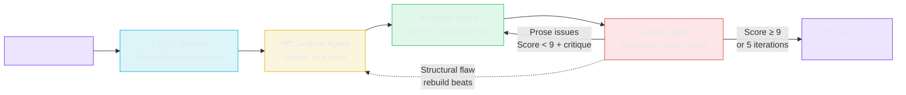

<p align="center">
  <h1 align="center">🩺 Script Doctor</h1>
  <p align="center">
    <strong>Multi-Agent AI Screenplay Pipeline — Autonomous Writer-Critic Loop with RAG Grounding & Structured Evaluation</strong>
  </p>
  <p align="center">
    
    
    
    
    
  </p>
</p>

---

An **agentic AI pipeline** that writes, critiques, and iteratively refines cinematic screenplay scenes. Three specialized LLM agents — **Outliner**, **Writer**, and **Critic** — collaborate in an autonomous loop powered by [LangGraph](https://www.langchain.com/langgraph), [Google Gemini 2.5 Flash](https://deepmind.google/technologies/gemini/flash/), and a RAG-grounded knowledge base of craft reference examples.

The pipeline runs until the Critic's structured rubric scores the draft **≥ 9/10** across five dimensions, or a maximum of **5 iterations** is reached — whichever comes first. The threshold is intentionally demanding: paired with a strict critic, first drafts don't clear it, so the Writer ↔ Critic refinement loop genuinely engages.

## ✨ Key Features

| Feature | Description |
|---------|-------------|
| **Multi-Agent Orchestration** | LangGraph state machine coordinates Outliner → Writer ↔ Critic with conditional looping |
| **Heterogeneous LLM Judge** | The Critic runs on a **different model family** (Groq Llama 3.3 70B) than the Gemini Writer, reducing the self-preference bias of a model grading its own output |
| **Structured Pydantic Rubric** | Critic evaluates across 5 dimensions (Dialogue, Pacing, Character Consistency, Thematic Resonance, Dramatic Tension) with enforced 0–10 scoring and a strict, first-draft-skeptical calibration |
| **Revisable Outline** | When the Critic diagnoses a *structural* flaw, the loop routes back to the Outliner to rebuild the beat sheet (bounded), not just polish prose |
| **RAG Grounding** | ChromaDB vector store with HuggingFace `all-MiniLM-L6-v2` embeddings retrieves genre-relevant craft examples to guide the Writer's technique; the index auto-rebuilds when the corpus changes (content fingerprint) |
| **Creative Defense Mechanism** | Writer justifies departures from Critic feedback, preventing blind regression across iterations |
| **Bounded Memory Buffers** | Both Writer and Critic see only the last 2 iterations of critique history, keeping prompts (and cost) from growing unboundedly across the loop |
| **Holistic Score Validator** | Pydantic validator lets the overall score diverge from the dimension mean for genuine holistic judgment, clamping only gross (>±2) drift |
| **Stagnation Convergence Detection** | Terminates revisions early if the overall score fails to set a new high for 2 consecutive iterations |
| **Transient-Aware Retries** | Exponential backoff with jitter on LLM calls, but fails fast on permanent errors (auth / bad-request) instead of burning the retry budget |
| **Concurrency-Guarded Server** | Web server bounds concurrent pipelines and returns `429` at capacity, so simultaneous requests can't exhaust the API quota |
| **Real-Time Web UI** | Flask + Server-Sent Events (SSE) stream pipeline progress live to the browser |
| **Interactive Report Dashboard** | Chart.js radar charts, threshold-aware score progression graphs, and per-iteration critique breakdowns |

## 🏗️ Architecture



### Agent Roles

| Agent | Model (default) | Purpose |
|-------|-------------|---------|
| **Outliner** | Gemini `gemini-2.5-flash` · temp 0.6 | Produces a detailed beat sheet breaking the scene into beginning/escalation/climax with emotional shifts and power dynamics |
| **Writer** | Gemini `gemini-2.5-flash` · temp 0.85 | Generates a fully formatted screenplay scene using the outline, RAG context, and critique history. Includes defense notes justifying creative choices |
| **Critic** | Groq `llama-3.3-70b-versatile` · temp 0.15 | Evaluates the draft against a 5-dimension Pydantic rubric. Returns structured scores, detailed critique, and 3–5 actionable revision instructions |

> **Heterogeneous judge (by design):** the Critic runs on a **different model family** (Groq's free-tier Llama 3.3 70B) than the Gemini Writer. Having one model grade another's work reduces the self-preference bias of a model judging itself, and its stricter scoring is what actually drives the revision loop. Every provider here has a **free tier** — you need a [Google AI Studio key](https://aistudio.google.com/apikey) (Outliner + Writer) and a [Groq key](https://console.groq.com/keys) (Critic). Override via `.env`: `CRITIC_PROVIDER=google` to keep everything on Gemini, or `OUTLINER_MODEL` / `WRITER_MODEL` / `CRITIC_MODEL` to swap specific models.

### Evaluation Rubric (Pydantic `ScriptEvaluation`)

```
┌──────────────────────────┬────────────────────────────────────────────────┐
│ Dimension                │ What It Measures                               │
├──────────────────────────┼────────────────────────────────────────────────┤
│ Dialogue (0–10)          │ Naturalness, subtext, character voice          │
│ Pacing (0–10)            │ Scene beats, lean action lines, no padding     │
│ Character Consistency    │ Faithfulness to prompt archetypes               │
│ Thematic Resonance       │ Emotional register, dramatic stakes             │
│ Dramatic Tension (0–10)  │ Clear stakes, escalation, meaningful hook      │
│ Overall (0–10)           │ Holistic verdict — 9+ reserved for exceptional │
└──────────────────────────┴────────────────────────────────────────────────┘
```

## 🚀 Quick Start

### Prerequisites

- **Python 3.11+**
- A **Google Gemini API key** (Outliner + Writer) — [free at AI Studio](https://aistudio.google.com/apikey)
- A **Groq API key** (Critic) — [free at Groq Console](https://console.groq.com/keys)

### Installation

```bash
# 1. Clone the repository
git clone https://github.com/YOUR_USERNAME/script-doctor.git
cd script-doctor

# 2. Create and activate a virtual environment
python -m venv venv
# Windows:
venv\Scripts\activate
# macOS/Linux:
source venv/bin/activate

# 3. Install dependencies
# (Production dependencies only)
pip install -r requirements.txt
# (Optional: install dev/testing tools)
pip install -r requirements-dev.txt

# 4. Configure your API keys (both free)
cp .env.example .env
# Edit .env and paste:
#   GOOGLE_API_KEY  — https://aistudio.google.com/apikey   (Outliner + Writer)
#   GROQ_API_KEY    — https://console.groq.com/keys         (Critic)
```

### Run via CLI

```bash
python main.py
```

This runs the full pipeline with the built-in default prompt and saves output files (`.txt` transcript + `.html` report) to the gitignored `runs/` directory.

### Run via Web UI

```bash
python api/server.py
```

Open [http://localhost:5000](http://localhost:5000) in your browser. Enter any scene premise and watch the agents work in real-time via SSE streaming.

Concurrency is bounded so simultaneous requests can't exhaust the Gemini quota: at most `MAX_CONCURRENT_JOBS` pipelines run at once (default 2) and up to `MAX_ACTIVE_JOBS` may be queued (default 8) before new requests receive `429`. Both are overridable via environment variables.

## 🧪 Evaluation & Observability

### Regression harness

A fixed set of scene prompts with **expectation bounds** (in [`eval/cases.yaml`](eval/cases.yaml)) guards against quality drift when you change a prompt, the rubric, or a model. Because scores vary run-to-run, expectations are *ranges* (min/max final score, iteration bounds, optional "must converge") — the harness catches drift, not natural variance.

```bash
python -m eval.harness                       # run all cases
python -m eval.harness --id vampire_hunter   # one case (cheap smoke)
python -m eval.harness --output runs/reg.json # also save JSON results
```

It prints a PASS/FAIL table with each run's score progression and exits non-zero if any case fails — ready to gate a CI job. The pure scoring logic (`evaluate_case`, `load_cases`) is unit-tested offline, so `pytest` stays fast and API-free.

### LangSmith tracing

Set the `LANGSMITH_*` variables in `.env` (see `.env.example`) and every agent call is automatically traced — **per-agent token counts, latency, inputs/outputs, and cost** — grouped under a project in the [LangSmith](https://smith.langchain.com/) UI. Tracing is entirely opt-in; with the variables unset the pipeline runs exactly as before.

## 📂 Project Structure

```
script-doctor/
├── .github/workflows/ci.yml # GitHub Actions — offline test suite on push/PR
├── main.py                  # CLI entry point + LangGraph state machine
├── agents/
│   ├── outliner.py          # Beat sheet / structural outline agent
│   ├── writer.py            # Screenplay drafting + revision agent
│   └── critic.py            # Structured rubric evaluation agent (Pydantic)
├── utils/
│   ├── llm.py               # Shared LLM factory (Gemini + Groq), cached
│   ├── retry.py             # Transient-aware backoff retry utility
│   └── tracing.py           # Opt-in LangSmith tracing configuration
├── rag/
│   └── retriever.py         # ChromaDB vector store + HuggingFace embeddings
├── data/
│   └── dialogues.txt        # Craft reference corpus (subtext, pacing, tension)
├── runs/                    # Generated .txt transcripts + .html reports (gitignored)
├── report/
│   └── generator.py         # Interactive HTML report with Chart.js dashboards
├── api/
│   ├── server.py            # Flask web server with SSE streaming
│   └── static/
│       └── index.html       # Frontend web UI
├── eval/
│   ├── cases.yaml           # Regression cases with expectation bounds
│   └── harness.py           # Regression runner + evaluation logic + report
├── tests/
│   ├── test_state_transitions.py   # State machine + graph structure tests
│   ├── test_critic_schema.py       # Pydantic evaluation rubric tests
│   ├── test_report_generator.py    # HTML report output tests
│   ├── test_eval_harness.py        # Regression harness logic tests
│   └── test_utils.py               # LLM factory + retry logic tests
├── requirements.txt         # Production dependencies
├── requirements-dev.txt     # Development/testing dependencies
├── pytest.ini               # Test configuration
├── .env.example             # Environment variable template
├── LICENSE                  # MIT
└── .gitignore
```


## 📊 Sample Output

A real run with the built-in prompt: *"A centuries-old vampire and a grizzled monster hunter are forced into a cathedral's basement to hide from an approaching mob. The holy ground is slowly draining the vampire's strength, and the hunter must decide whether to protect his ancient enemy or let the mob do his job for him."*

### Score Progression

| Iteration | Dialogue | Pacing | Character | Theme | Tension | **Overall** |
|:---------:|:--------:|:------:|:---------:|:-----:|:-------:|:-----------:|
| 1         | 7        | 8      | 8         | 8     | 8       | **7**       |
| 2         | 9        | 8      | 9         | 9     | 9       | **8**       |
| 3         | 9        | 9      | 9         | 9     | 9       | **9** ✅    |

> The strict Groq critic scored the first draft **7/10** and demanded revisions; the Writer refined across three cycles until the draft earned a **9/10** and converged. Note the overall is the Critic's *holistic* verdict — deliberately allowed to sit below the raw dimension average (e.g. iteration 1) rather than being a mechanical mean.

## 🛠️ Tech Stack

| Component | Technology | Purpose |
|-----------|-----------|---------|
| **Agent Orchestration** | [LangGraph](https://www.langchain.com/langgraph) | State machine with conditional edges for the Writer ↔ Critic loop |
| **LLMs** | [Gemini 2.5 Flash](https://deepmind.google/technologies/gemini/) (Outliner/Writer) + [Groq Llama 3.3 70B](https://console.groq.com/) (Critic) | Heterogeneous multi-provider setup via `langchain-google-genai` + `langchain-groq` |
| **Structured Output** | [Pydantic v2](https://docs.pydantic.dev/) | Type-safe evaluation rubric with field-level validators |
| **Vector Store** | [ChromaDB](https://www.trychroma.com/) | Persistent local vector database, singleton client, with fingerprint-based auto-rebuild on corpus change |
| **Embeddings** | [sentence-transformers/all-MiniLM-L6-v2](https://huggingface.co/sentence-transformers/all-MiniLM-L6-v2) | Screenplay-aware semantic text splitting with HuggingFace embeddings |
| **Web Server** | [Flask](https://flask.palletsprojects.com/) | REST API + Server-Sent Events for real-time streaming |
| **Visualization** | [Chart.js](https://www.chartjs.org/) | Radar charts and line graphs in the HTML report |

## 🔮 Roadmap & Future Improvements

**Recently shipped**
- [x] **Heterogeneous LLM judge** — Gemini writer graded by a Groq Llama critic
- [x] **Revisable outline** — structural flaws route back to the Outliner
- [x] **Regression harness** — fixed case set with expectation bounds to catch quality drift
- [x] **LangSmith tracing** — opt-in per-agent token / latency / cost observability
- [x] **Configurable models/providers** — per-agent overrides via `.env`
- [x] **Fingerprint-based RAG rebuild**, bounded memory, transient-aware retries, server concurrency guard

**Output quality**
- [ ] **Expanded RAG corpus** — 100+ craft examples across genres with metadata filtering (genre/tone), so retrieval is sharper than the current ~18-example set
- [ ] **Multi-critic ensemble** — score with 2–3 independent judges (e.g. Groq + Gemini + a local model) and aggregate, reducing single-judge variance
- [ ] **Specialist critics** — a dedicated dialogue critic, structure critic, etc., instead of one generalist rubric
- [ ] **Per-note resolution tracking** — verify each required improvement was actually addressed in the next draft (close the feedback loop explicitly)

**Observability & evaluation**
- [ ] **Expand & calibrate the regression suite** — more cases and tighter bounds once baseline runs exist; wire it into GitHub Actions as a nightly (API-gated) job
- [ ] **Token/cost budget in the harness** — surface per-run tokens and $ alongside scores (pulled from LangSmith or usage metadata)
- [ ] **Side-by-side diff view** — highlight exactly what changed between Writer iterations

**Product & ops**
- [x] **GitHub Actions CI** — offline test suite runs on every push / PR
- [ ] **Run history & comparison** — persist runs and diff score progressions across prompts/configs
- [ ] **Human-in-the-loop steering** — pause for user approval or manual notes between iterations
- [ ] **Export to PDF**, **Docker deployment**, **lint (ruff) in CI**

## 📜 License

Released under the [MIT License](LICENSE) — free to use, modify, and distribute. Built for educational and portfolio purposes.

---

<p align="center">
  <sub>Built with ❤️ using LangGraph, Google Gemini, Groq, and ChromaDB</sub>
</p>
